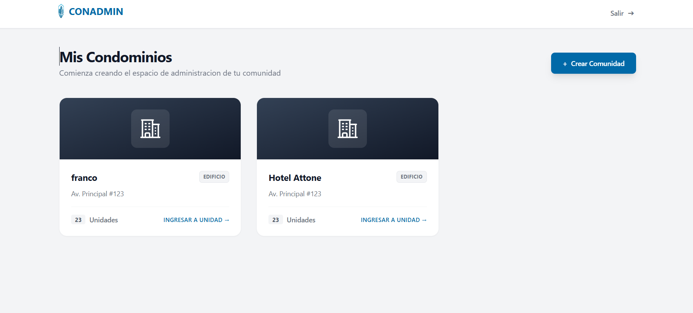
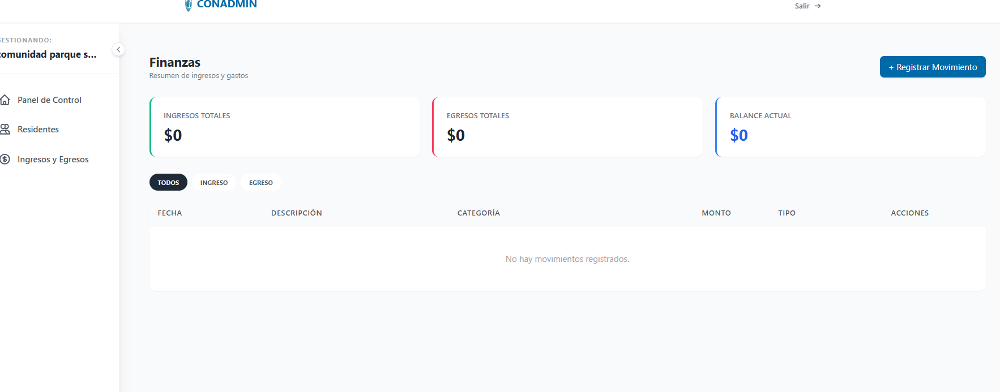

# CONADMIN - Sistema de Gestión de Comunidades

¡Bienvenido a **CONADMIN**! Una solución integral, moderna y elegante diseñada para simplificar la administración de edificios y comunidades. Este sistema permite gestionar residentes, registrar flujos de caja en tiempo real y visualizar estadísticas clave a través de un panel de control intuitivo.

 

---

##  Características Principales

* Dashboard Inteligente:** Visualización de KPIs como total de residentes, unidades ocupadas y balance mensual.
* Gestión de Residentes:** Registro completo y control de unidades habitacionales.
* Control Financiero:** Registro detallado de transacciones con filtros por tipo (Ingreso/Egreso).
* Seguridad Avanzada:** Autenticación mediante JWT (JSON Web Tokens) y protección de rutas por comunidad.
* Interfaz Premium:** Diseño sobrio y minimalista construido con Tailwind CSS e iconos de Lucide React.

---

##  Stack Tecnológico

### Frontend
- **React.js** (Vite)
- **Tailwind CSS** (Estilos modernos y responsivos)
- **Axios** (Consumo de API)
### Backend
- **Python (Flask)**
- **SQLAlchemy** (ORM para base de datos)
- **MySQL** (Persistencia de datos)
- **Pydantic** (Validación de esquemas y tipos)
- **CORS** (Configuración de seguridad entre dominios)

---

